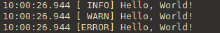

# go-log
go-log is logger for Go




## example 
### default 
```go
package main

import (
	"github.com/winey-dev/go-log"
)

func main() {
	// default log level info and output mode console
	// default formatter is defaultFormatter
	//    fmt.Sprintf("%s [%5s] %s", t.In(time.Local).Format(time.TimeOnly+".000"), loglevelNames[level], fmt.Sprintf(format, args...))
	// default location is time.Local
	mlog, err := log.NewLogger("my-app")
	if err != nil {
		panic(err)
	}
	defer mlog.Close()

	mlog.Info("Hello, World!\n")
	mlog.Debug("Hello, World!\n")
	mlog.Warn("Hello, World!\n")
	mlog.Error("Hello, World!\n")
}
```

### change loglevel 
```go
    ...
    mlog.SetLogLevel(log.DEBUG)
    ...
```

### use both console and file 
```go
    ...

    mlog, err := log.NewLogger("my-app",
        // func WithFileMode(fileName, logPath string, mode FileCreateMode) LogOption
        // fileName default set `logName` from NewLogger(logName, ...)
        // logPath default set `log` ${excute binary path}/log
        log.WithFileMode("", "", log.DAILYMODE),
    )
    ...
```

- output
```bash
 ┌── ☁   ~/github.com/go-log/example ⚡  
 └── ⚡  ./example 
10:27:29.995 [ INFO] Hello, World!
10:27:29.995 [ WARN] Hello, World!
10:27:29.995 [ERROR] Hello, World!
 ┌── ☁   ~/github.com/go-log/example/log ⚡  
 └── ⚡  ls
my-app.2025-03-21.log

 ┌── ☁   ~/github.com/go-log/example/log ⚡  
 └── ⚡  cat my-app.2025-03-21.log 
10:27:29.995 [ INFO] Hello, World!
10:27:29.995 [ WARN] Hello, World!
10:27:29.995 [ERROR] Hello, World!
```

### only file mode 
```go
    ...
    mlog, err := log.NewLogger("my-app",
        // func WithFileMode(fileName, logPath string, mode FileCreateMode) LogOption
        // fileName default set `logName` from NewLogger(logName, ...)
        // logPath default set `log` ${excute binary path}/log
        log.WithFileMode("", "", log.DAILYMODE),
        log.WithConsoleModeOff(),
    )
    ...
```